# ☁️ Deploy de Máquina Virtual Windows no Azure

> 📚 Atividade prática realizada no Portal do Azure  
> 🎯 Objetivo: Criar e configurar uma VM Windows Server 2022 e validar acesso via RDP + IIS  

---

## 🚀 Objetivo da Atividade

Realizar o provisionamento de uma **Máquina Virtual Windows** no Microsoft Azure, incluindo:

- Criação da VM via Portal  
- Liberação de portas (RDP e HTTP)  
- Acesso remoto via RDP  
- Instalação do servidor web IIS  
- Validação via navegador  

---

## 🛠️ Tecnologias Utilizadas

- Microsoft Azure  
- Windows Server 2022 Datacenter  
- RDP (Remote Desktop Protocol)  
- IIS (Internet Information Services)  
- PowerShell  

---

## 📋 Etapas Realizadas

### 🔐 1. Acesso ao Portal Azure

- Login no portal do Azure  

📸 **Evidência:**

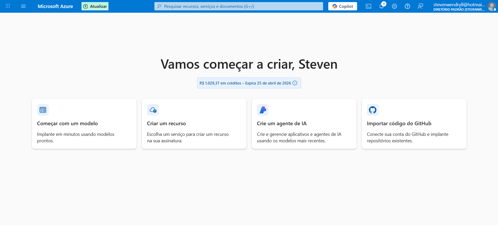

---

### 🖥️ 2. Criação da Máquina Virtual

- Serviço selecionado: Máquinas Virtuais  
- Nome da VM: `VmTeste1`  
- Imagem: Windows Server 2022 Datacenter  
- Usuário administrador criado  

📸 **Evidência:**  

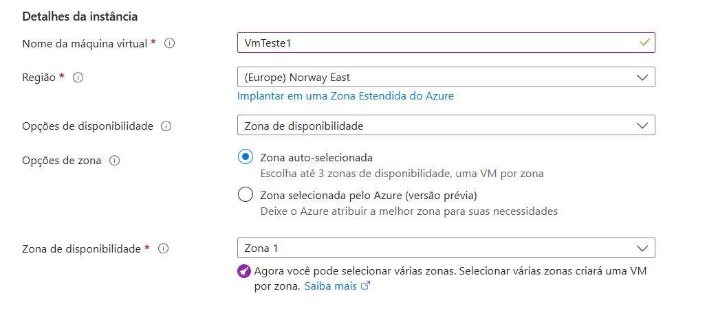
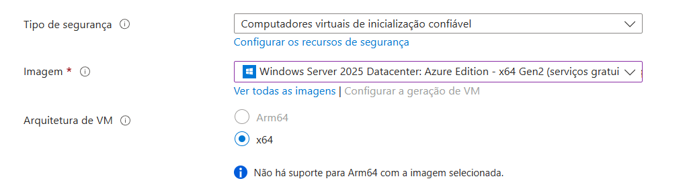
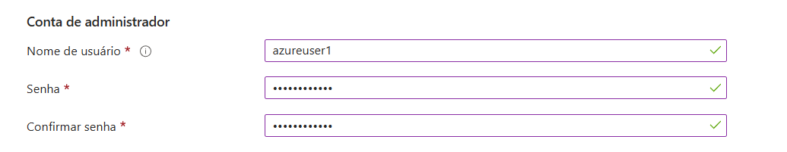

---

### 🌐 3. Configuração de Rede

- Portas liberadas:
  - RDP (3389)
  - HTTP (80)

📸 **Evidência:**  

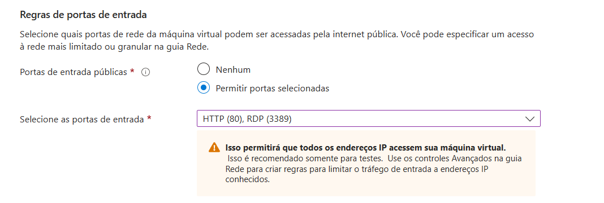

---

### ⚙️ 4. Configurações Adicionais

- Habilitado desligamento automático  
- Fuso horário configurado  

---

### ✅ 5. Validação e Criação

- Validação dos recursos  
- Criação da VM iniciada  

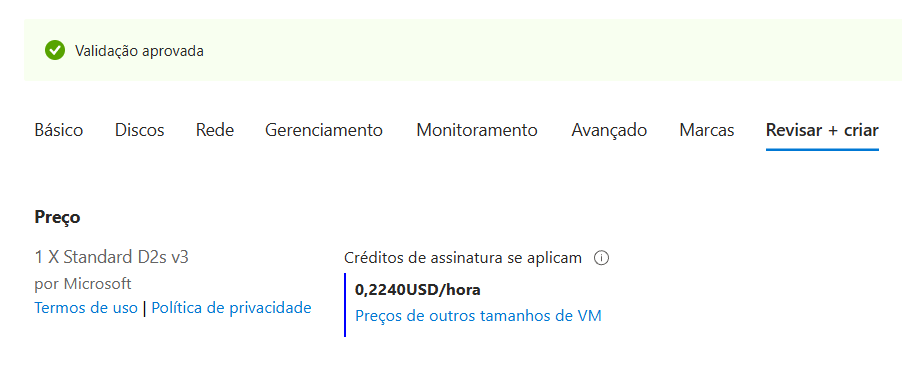
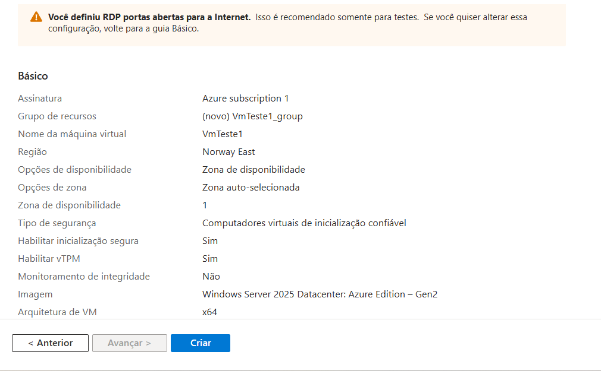
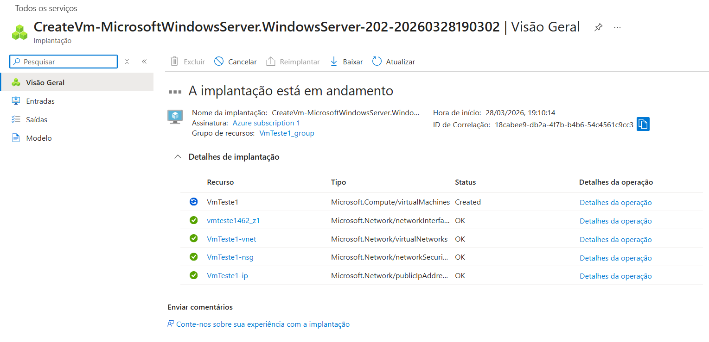
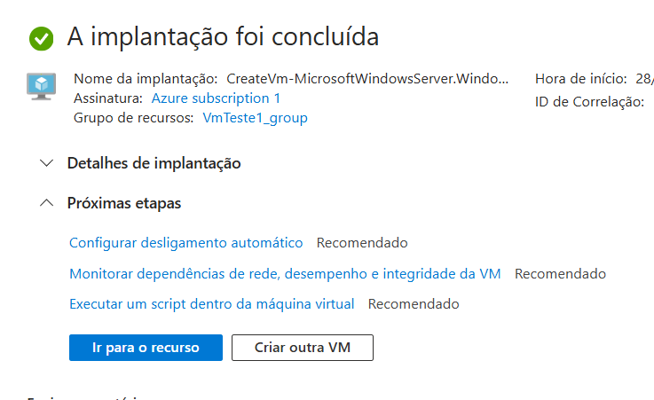

---

### 🔗 6. Conexão via RDP

- Download do arquivo `.rdp`  
- Conexão com a VM usando credenciais criadas  

---

### 🌍 7. Instalação do IIS

Comando executado no PowerShell:

powershell
```Install-WindowsFeature -name Web-Server -IncludeManagementTools```

📸 **Evidência:**  

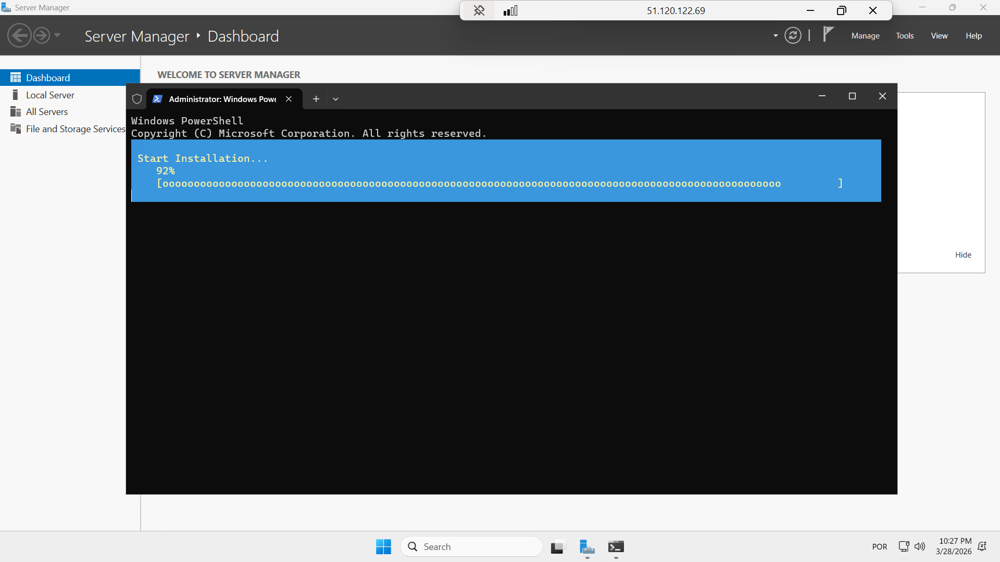

---

### 🌐 8. Teste no Navegador

- Acesso via IP público da VM
- Exibição da página padrão do IIS

📸 **Evidência:**  

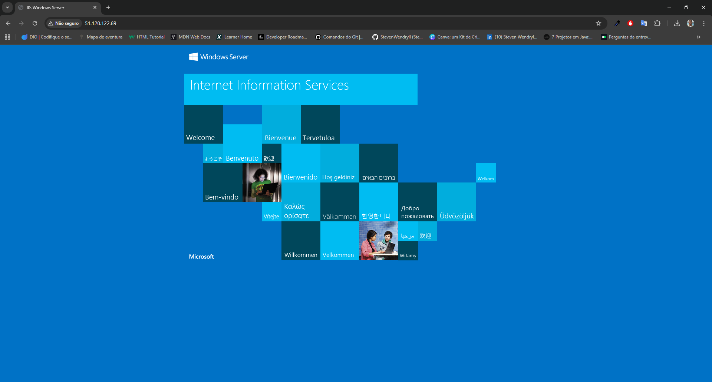

---

### 🧹 9. Limpeza dos Recursos

- Exclusão do grupo de recursos
- Remoção da VM e serviços associados

---

### 📊 Resultados Obtidos

✔️ VM criada com sucesso
✔️ Conexão remota estabelecida via RDP
✔️ Servidor IIS instalado e funcional
✔️ Página web acessível via navegador

### ⚠️ Observações
Esta atividade foi realizada para fins educacionais
Não representa um ambiente de produção
Configurações de segurança adicionais seriam necessárias em cenário real

### 🎯 Conclusão

A prática permitiu compreender na prática:

Provisionamento de infraestrutura em nuvem
Configuração de acesso remoto
Publicação de serviços web
Gerenciamento de recursos no Azure
